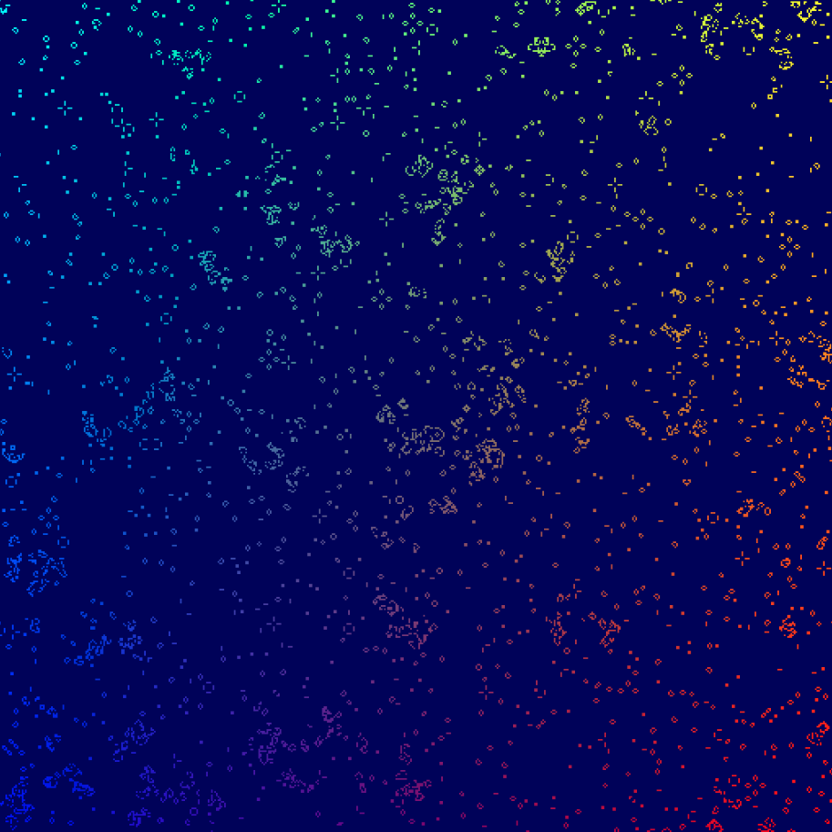

# Game of Life with WebGPU

Followed [this tutorial](https://codelabs.developers.google.com/your-first-webgpu-app) to implement `Conway's Game of Life` using WebGPU. Will be using this as a starting point to implement other simulations.
